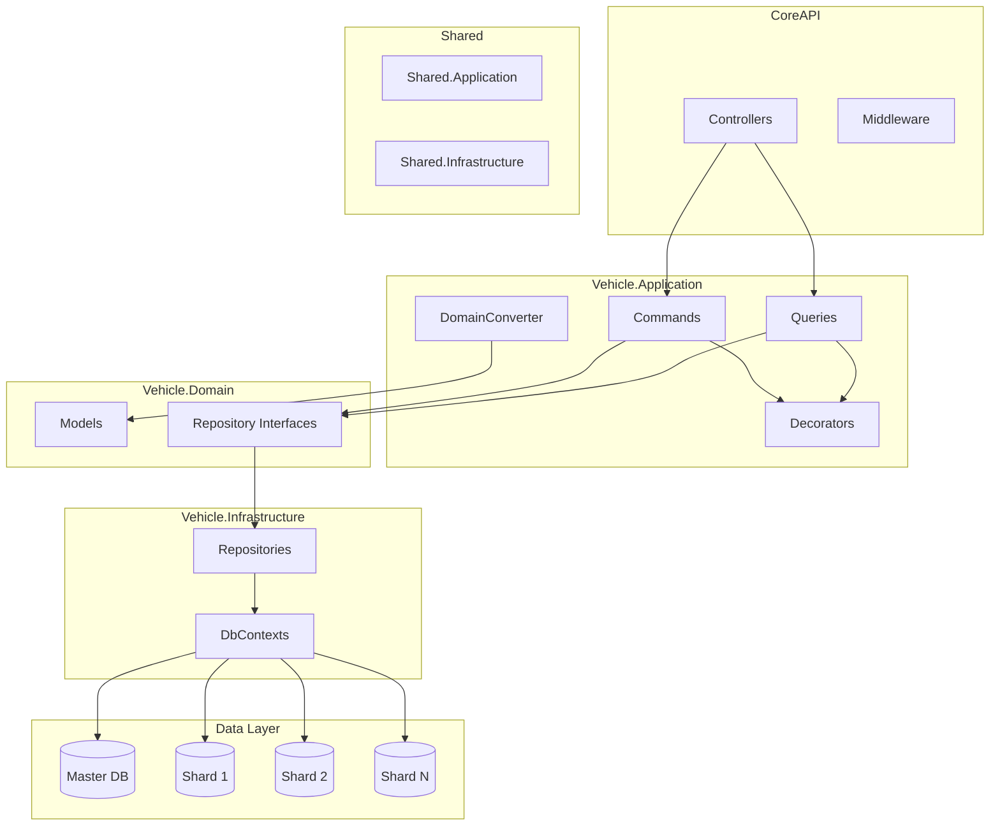

# SupaDupaBase

A modular .NET API with database sharding, CQRS, and multi-tenant support. Built for portability and quick setup; some features are intentionally deferred.

---

## Architecture



**Request flow:** Client → CoreAPI (Controllers/Middleware) → Application (Commands/Queries) → Domain (Interfaces) → Infrastructure (Repositories/DbContexts) → SQL Server (Master + Shards).

---

## Patterns Used

| Pattern | Where |
|--------|--------|
| **Clean Architecture** | CoreAPI, Vehicle.Application, Vehicle.Domain, Vehicle.Infrastructure; dependencies point inward to Domain. |
| **CQRS** | Commands (write) and Queries (read) with separate handlers; dispatch via `Messages`. |
| **Repository** | `IBaseRepository` / `IVehicleRepository`; data access abstracted from application. |
| **Unit of Work** | DbContext as `IUnitOfWork`; `SaveChangesAsync` per request/transaction. |
| **Result** | Command handlers return `Result` / `Result.Fail` instead of throwing. |
| **Decorators** | Logging, Validation, Audit, Transaction around command/query handlers. |
| **Database sharding** | One Master DB (person/shard mapping) + N shard DBs; routing by `PersonContext`. |
| **API response wrapper** | All endpoints return `ApiResponse<T>` (Success, Message, Data, ErrorCode, Timestamp). |

---

## User Guide

### Prerequisites

- .NET 10 SDK
- SQL Server (local or remote)

### 1. Configure connection strings

Edit `CoreAPI/appsettings.json` (and `appsettings.Development.json` if you use it).

**ConnectionStrings**

- **Master** – Full connection string **including** `Database=...`.  
  Replace with your real server and credentials; the Master database will be created/migrated on startup.

```json
"ConnectionStrings": {
  "Master": "Server=YOUR_SERVER;Database=SupaDupaMaster;User Id=YOUR_USER;Password=YOUR_PASSWORD;TrustServerCertificate=true;",
  "ShardingBase": "Server=YOUR_SERVER;User Id=YOUR_USER;Password=YOUR_PASSWORD;TrustServerCertificate=true;"
}
```

- **ShardingBase** – Same server and credentials but **must NOT contain `Database=`**.  
  Shard databases (e.g. `SupaDupaSharding1`, `SupaDupaSharding2`, …) are created and migrated automatically using this base.

### 2. Configure number of shards

In `CoreAPI/appsettings.json`:

```json
"Sharding": {
  "TotalShards": 3,
  "HotShard": null
}
```

Set `TotalShards` to how many shard databases you want. Each shard is created as `SupaDupaSharding{1..N}`.

### 3. Configure CORS for your frontend

Add the origin(s) of your frontend (URL and port) so the API allows requests from the browser:

```json
"Cors": {
  "AllowedOrigins": [
    "http://localhost:3000",
    "http://localhost:5173",
    "https://localhost:7000",
    "https://localhost:7148",
    "http://localhost:4200",
    "http://YOUR_FE_IP_OR_HOST:PORT"
  ]
}
```

Replace or add `http://YOUR_FE_IP_OR_HOST:PORT` with the actual address of your frontend (e.g. `http://192.168.1.10:3000`).

### 4. Run the API

```bash
cd CoreAPI
dotnet run
```

On startup:

- Master database is created/migrated.
- Shard databases (1 through `TotalShards`) are created/migrated.
- Swagger UI is available in Development at `/swagger`.

Use the configured URLs (e.g. `https://localhost:7148`) and ensure your frontend calls these origins that you added in CORS.

---

## Features to Develop (TODO)

Search the solution for `// TODO` to find planned work:

| Location | TODO |
|----------|------|
| `Vehicle.Infrastructure/Repositories/VehicleRepository.cs` | Extend LicensePlate search to **full-text search** (see `Vehicle.Domain/Models/Vehicle.cs`). |
| `CoreAPI/Program.cs` | Configure **logging** (e.g. Serilog, OpenTelemetry) and export to external systems. |
| `CoreAPI/Middleware/PersonContextResolver.cs` | Add **caching** for person context by `personSyncId` to reduce Master DB calls. |
| `Vehicle.Application/Commands/CreatePersonCommand.cs` | Replace direct DB call with a **message broker** for eventual consistency. |

Implementing these will improve search, observability, performance, and consistency.

---

## Not Implemented (Portability / Time)

To keep the project portable and quick to run, the following are **not** implemented:

- **Message broker** (e.g. RabbitMQ, Kafka) – for async/eventual consistency (see CreatePersonCommand TODO).
- **External logging/query stack** (e.g. Elasticsearch) – for centralized log storage and querying.
- **Full-text search** – vehicle filter uses simple string contains; full-text search is left as TODO in `VehicleRepository`.
- **Other external services** – no dependency on third-party SaaS or extra servers beyond SQL Server and the API host.

The app is designed to run with **SQL Server + CoreAPI** only; optional features can be added later via the TODOs above.

---

## Project structure

```
SupaDupaBase/
├── CoreAPI/                 # Web API, middleware, Swagger
├── Shared.Application/      # CQRS interfaces, Result, PersonContext
├── Shared.Infrastructure/   # Sharding DB provider, DbContext factory
├── Vehicle.Application/     # Commands, Queries, DTOs, Converters, Decorators
├── Vehicle.Application.Tests/
├── Vehicle.Domain/          # Entities, repository interfaces
├── Vehicle.Infrastructure/  # EF Core, repositories, migrations (Master + Sharding)
└── README.md
```

---

## License

See repository or solution root for license information.
